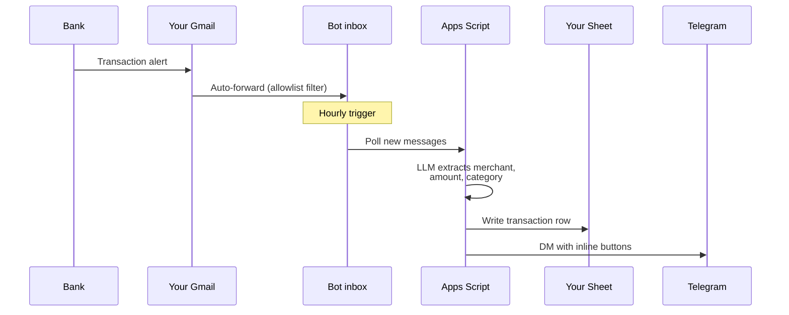

# 💰 Dus Aane Bot

<!-- TODO: replace with assets/hero.png — wide 1280×640 banner combining logo + a phone mockup showing the txn card. Also upload to GitHub → Settings → Social preview. -->
<p align="center">
  
</p>

<p align="center">
  <b>Splitwise that fills itself in — from your bank emails, into your own Google Sheet.</b>
</p>

<p align="center">
  <a href="https://t.me/dusaanebot">💬 Try the bot</a> ·
  <a href="#-as-a-user">📖 User guide</a> ·
  <a href="#-as-an-operator-self-host">🛠 Self-host</a> ·
  <a href="https://github.com/Rrishik/dus-aane-bot/stargazers">⭐ Star this repo</a>
</p>

<p align="center">
  
  
  
  
  
  
</p>

Forward a bank email; the bot reads it, categorises it, and writes a row to a Google Sheet you own. Tap one button to split it 50/50 with your partner — the group chat gets a notification, the math is done. Ask `/ask how much on food this month?` in plain English. No data entry, no app to install, no full-Gmail OAuth grant to a black box.

## See it in action

<!-- TODO: replace these 6 placeholders with real screenshots. Capture from a phone in dark mode; sanitize names ("Alice"/"Bob") and amounts. See shot list below.
  - assets/demo.gif         — 10s loop: bank email → DM card → ✂️ Split → group notification
  - assets/01-txn-card.png  — a single transaction DM with the inline button row
  - assets/02-new-merchant.png — card showing 🆕 Save and 🏪 Edit Merchant buttons
  - assets/03-group-split.png  — the auto-posted split notification in the group chat
  - assets/04-stats.png        — /stats settlement view ("Bob owes Alice ₹1,250")
  - assets/05-ask.png          — /ask natural-language Q&A
-->

<p align="center">
  
</p>

<table>
  <tr>
    <td></td>
    <td></td>
  </tr>
  <tr>
    <td align="center"><em>Every email becomes a one-tap card.</em></td>
    <td align="center"><em>New merchant? One tap teaches the bot.</em></td>
  </tr>
  <tr>
    <td></td>
    <td></td>
  </tr>
  <tr>
    <td align="center"><em>Splits land in the group chat automatically.</em></td>
    <td align="center"><em><code>/stats</code> rolls every split into a settlement.</em></td>
  </tr>
  <tr>
    <td colspan="2"></td>
  </tr>
  <tr>
    <td colspan="2" align="center"><em>Ask in plain English — <code>/ask</code> calls structured tools, not RAG.</em></td>
  </tr>
</table>

## Why not just use CRED, Walnut, or Splitwise?

Closed-source finance apps typically ask for **full Gmail read access** via OAuth — which lets them scan everything: OTPs, statements, personal mail, receipts, newsletters. You trust them to look only at what they claim.

Dus Aane Bot inverts that:

|                                       | CRED / Walnut / etc.                          | Dus Aane Bot                                                                  |
| ------------------------------------- | --------------------------------------------- | ----------------------------------------------------------------------------- |
| **Access scope**                      | Full Gmail read (all mail, all labels)        | Only emails you forward to the bot inbox                                      |
| **OTPs / statements / personal mail** | Readable by the app                           | Never leaves your Gmail                                                       |
| **Data location**                     | Their servers, their schema                   | Your Google Sheet, your account                                               |
| **Export / delete**                   | Via their UI, if offered                      | Native Google Sheets — yours forever                                          |
| **Source code**                       | Closed                                        | [This repo](https://github.com/Rrishik/dus-aane-bot) — audit before you trust |
| **Revoke access**                     | OAuth revoke (still had full read until then) | Delete the Gmail filter                                                       |
| **Shared expenses**                   | Manual entry (Splitwise) or absent            | One-tap split, group chat notification, settlement math built in              |

## What the bot can — and can't — see

> **The bot never sees:** OTPs · bank statements · personal email · receipts · newsletters · anything else in your inbox.
> **The bot only sees:** emails from ~30 verified bank addresses that you explicitly forward.

The trust model is a one-time Gmail filter that matches a **fixed allowlist of verified bank sender addresses** (see [`TRANSACTION_SENDERS`](Constants.js)). Nothing else is ever forwarded. If you don't trust the allowlist, read it — it's in this repo.

## Who it's for

- 👫 **Couples** — one of you registers, the other gets added to a 2-person group. Every bank email becomes a card; one tap splits it 50/50. `/stats` shows who owes whom.
- 🏠 **Roommates** (up to 4) — same idea, with `Split with everyone`, `Split with everyone except X`, and `Just me + person Y` modes for the messy edge cases.
- ✈️ **Friends on a trip** — spin up a group, share expenses for the trip duration, run `/stats simplify` at the end to settle in minimum-transfer mode.
- 🧑‍💻 **Anyone who wants automated personal expense tracking** — works fine solo; you just never tap the Split button.

## How it works



1. Each user sets up a Gmail filter that forwards only verified transaction-alert senders (see [`TRANSACTION_SENDERS`](Constants.js)) to the bot inbox.
2. An hourly Apps Script trigger polls the bot inbox, extracts the forwarder's email from the `X-Forwarded-For` or `From:` header, looks up the tenant, and writes to their sheet.
3. For each saved transaction the bot DMs the user with inline buttons for split status, category edit and delete.

The Gmail filter on the user's side is the **primary privacy boundary** — the bot literally never sees mail that doesn't match the allowlist.

## Features

- 🤖 **AI-powered extraction** — Azure OpenAI with tool calling pulls merchant, amount, date, category, currency and type from emails. Falls back to a `get_merchant_category` tool when unsure.
- 👫 **One-tap splits** — `Personal` / `50–50` / `Partner paid 100%` / `Split with all` / `Everyone except X` / `Just me + Y`. `/stats` rolls it into a who-owes-whom settlement with optional minimum-transfer simplification.
- 💬 **`/ask` in plain English** — 6 structured tools (`get_spending_summary`, `get_category_breakdown`, `get_top_merchants`, `get_user_spend`, `get_split_summary`, `search_transactions`). Tool calling stays at ~600 base tokens regardless of data volume.
- 📊 **Your sheet, your data** — each tenant gets their own Google Sheet, shared with them as editor on day 1. Native CSV export, Sheets formulas, Apps Script — anything you can do with a spreadsheet, you can do here.
- 🧠 **Self-improving merchant map** — `MerchantResolution` maps raw bank strings (`FLIPKART_MWS_MERCH`) to clean names (`Flipkart`); `CategoryOverrides` maps merchant → default category. Shared across tenants — your taps train the bot for everyone.
- ⏪ **`/backfill`** — reprocess any date range in 5-minute chunks with progress updates.
- 🔒 **Allowlist-only ingestion** — bot only sees emails matching ~30 fixed bank senders. OTPs, statements, security codes and personal mail never leave your Gmail.
- 🚀 **CI/CD** — GitHub Actions push to Apps Script and Cloudflare on every commit to `main`.

## Get started

### 👤 As a user

1. **DM the bot** → [@dusaanebot](https://t.me/dusaanebot) → `/start`.
2. **`/register your.email@gmail.com`** — the bot emails you a 3-step Gmail auto-forwarding setup (add forwarding address → verify → create filter) with a one-tap **Verify forwarding address** button.
3. **First valid forward arrives**. The bot provisions your own Google Sheet, shares it with you as editor, and DMs you the link.

From here, every matching transaction email auto-forwards; you get a Telegram notification within the hour. Full flow details: [User onboarding](#user-onboarding).

### 🛠 As an operator (self-host)

Want to host it for your friend group? One Apps Script deploy serves everyone — they self-onboard with `/start`. Roughly 15 minutes if you've used clasp before. Expand the section below for the full 10-step setup.

<details>
<summary><b>Self-host setup (10 steps)</b></summary>

#### Prerequisites

- Dedicated Gmail account for the bot (this is where all tenant forwards land)
- Telegram bot token, Azure OpenAI API key, Cloudflare account (free, for the Telegram proxy Worker)
- Node.js + `npm install -g @google/clasp`

#### One-time setup

1. **Bot Gmail account** — create `dusaanebot.inbox@gmail.com` (or your own address — update `BOT_INBOX_EMAIL` in [Constants.js](Constants.js) if different).
2. **Apps Script project** — `clasp login` as the bot Gmail → `clasp create --type standalone --title "dus-aane-bot" --rootDir .`.
3. **Secrets (`AConfig.js`, gitignored)** — create it locally with these constants:
   ```js
   const BOT_TOKEN = "...";
   const ADMIN_CHAT_ID = "..."; // admin / founder chat id (tenant 0)
   const SCRIPT_APP_URL = "https://script.google.com/macros/s/.../exec";
   const WORKER_PROXY_URL = "https://your-worker.workers.dev";
   const ADMIN_SHEET_ID = "..."; // admin sheet — hosts the Tenants registry + tenant 0's data
   const SHEET_NAME = "Transactions";
   const TEMPLATE_SHEET_ID = ""; // filled in step 6 below
   const GROUP_TEMPLATE_SHEET_ID = ""; // filled in step 7 below; leave blank to disable group features
   const AZURE_OPENAI_ENDPOINT = "...";
   const AZURE_OPENAI_API_KEY = "...";
   const AZURE_OPENAI_DEPLOYMENT_NAME = "...";
   const AZURE_OPENAI_API_VERSION = "2024-08-01-preview";
   ```
4. `clasp push` → open the project in the script editor → authorize all OAuth scopes (Gmail, Sheets, Drive, URL fetch).
5. Deploy as Web App (execute as bot account, access: Anyone) → note the `/exec` URL + deployment ID.
6. **Create the template sheet** — in the script editor, run `adminCreateTemplateSheet()`. It copies your admin sheet structure, clears the data, and logs the new sheet ID. Put that ID in `AConfig.js` as `TEMPLATE_SHEET_ID` and in the GitHub secret.
7. **Create the group-sheet template** (optional; needed for the Groups feature) — run `adminCreateGroupTemplateSheet()`. It creates a fresh blank spreadsheet pre-loaded with the per-share group schema and logs its ID. Put that ID in `AConfig.js` as `GROUP_TEMPLATE_SHEET_ID` and in the GitHub secret.
8. **Cloudflare Worker** — set `APPS_SCRIPT_URL` secret, `wrangler deploy` (or use the GitHub Actions workflow).
9. **Bot wiring** — from the script editor, run `setTelegramWebhook()` (points Telegram at the worker) and `setTelegramCommands()` (registers the slash-menu).
10. **Trigger** — add an hourly trigger for `triggerEmailProcessing` (Triggers panel in the script editor).

That's it — the bot is live. Share it by giving people the Telegram handle; they self-onboard with `/start`.

#### Updating the bank sender allowlist

Edit `TRANSACTION_SENDERS` in [Constants.js](Constants.js) to add a new bank. The `scripts/gen-gmail-filter.js` script regenerates the Gmail filter query from that list, but **users don't need to re-paste their filter** when you add a sender — their existing filter just won't match the new sender until they re-paste. The bot auto-sends the fresh query on `/register` so new tenants always get the latest.

</details>

## User onboarding

This is the detailed flow once the bot is deployed.

**From Telegram:**

1. `/start` — bot shows the welcome.
2. `/register your.name@gmail.com` — the bot:
   - Reserves a pending tenant slot keyed to your chat + email.
   - Emails `your.name@gmail.com` a 3-step auto-forwarding setup (add forwarding address → verify → create filter), with a one-tap **Verify forwarding address** button that auto-confirms the Gmail verification code.
   - DMs an ack with a manual-forward fallback (forward any bank email to `dusaanebot.inbox@gmail.com`) so you can start using it immediately.
3. **First valid forward arrives** (manual or filter-driven). The bot:
   - Provisions a new Google Sheet (a copy of the template).
   - Shares it with `your.name@gmail.com` as editor.
   - DMs you a "first transaction is in" confirmation; Google emails you a share notification with the sheet link.
4. `/account` — view status; tap **📬 Resend auto-forwarding setup** if you lost the email.

From here, every matching transaction email auto-forwards; the hourly trigger processes it and you get a Telegram notification within the hour.

## Commands

| Command                           | Description                                                                                              |
| --------------------------------- | -------------------------------------------------------------------------------------------------------- |
| `/start`                          | Welcome + onboarding instructions                                                                        |
| `/register [email]`               | Claim a Gmail address; emails the auto-forwarding setup steps. Bare `/register` prompts for the address. |
| `/account`                        | Show tenant status, registered emails, sheet status; one-tap resend of the auto-forwarding setup email   |
| `/recent [N] [user]`              | Recent transactions with optional filters                                                                |
| `/stats`                          | Analytics dashboard — monthly / trends / who owes                                                        |
| `/ask <question>`                 | AI-powered spending queries (e.g., "food spending last month")                                           |
| `/help`                           | Show commands                                                                                            |
| `/backfill 10m`                   | Backfill last N minutes/hours (compact: `10m`, `2h`, `3d`, `1w`)                                         |
| `/backfill 3 days`                | Backfill last N days/weeks/months                                                                        |
| `/backfill YYYY-MM-DD YYYY-MM-DD` | Backfill a date range                                                                                    |

### Inline buttons

Each transaction notification includes action buttons:

- **✂️ Split** — cycles `Personal` → `Split (50/50)` → `Partner (I paid 100% on their behalf)` → `Personal`
- **✏️ Category** — shows a category picker (debit or credit categories based on the row's type)
- **🗑️ Delete** — removes the transaction row
- **🏠 Set Merchant** — shown when the LLM couldn't identify a merchant; you type the name and the category auto-fills if there's a `CategoryOverrides` entry

### New-merchant flow

When a brand-new merchant is detected, two extra buttons appear above the standard row:

- **🆕 Save: `<merchant>` → `<category>`** — one-tap confirm. Writes the resolved name to `MerchantResolution` and the category to `CategoryOverrides`.
- **🏪 Edit Merchant** — force-reply prompt for the merchant name, then shows the category picker. Updates both sheets plus the transaction row.

## Under the hood

<details>
<summary><b>Data model</b> — sheet schemas, per-share group rows, shared registry tabs</summary>

Each personal tenant's spreadsheet has **one** tab — their transactions:

| Columns                                                                                                         | Purpose                 |
| --------------------------------------------------------------------------------------------------------------- | ----------------------- |
| Email Date, Txn Date, Merchant, Amount, Category, Type, User, Message ID, Currency, Group Ref, Group Message ID | One row per transaction |

`Group Ref = "<group_chat_id>:<Tx ID>"` and `Group Message ID = telegram message_id of the group notification` are populated when a transaction is split into a group; both are blank for personal-only rows. The Message ID column (Gmail dedupe key) and the two group-linkage columns are stored visibly in the schema but **hidden by default** — unhide them from the sheet's column controls if you want to inspect.

Group tenants get their own spreadsheet with the **per-share β schema** — one row per share, so a 4-way split is 4 rows linked by the same Tx ID:

| Columns                                                                                                                    | Purpose           |
| -------------------------------------------------------------------------------------------------------------------------- | ----------------- |
| Email Date, Tx Date, Merchant, Amount, Currency, Paid By, Share Holder, Share Amount, Tx ID, Category, Tx Type, Message ID | One row per share |

`Tx Type = "Settlement"` (with `Category = "Settlement"`) marks settlement rows that _reduce_ what the payer owes the share-holder, instead of adding to the debt.

The admin sheet (pointed at by `ADMIN_SHEET_ID`) hosts **shared registry + mapping** tabs used across all tenants:

| Tab                    | Columns                                                                                                                                         | Purpose                                                                     |
| ---------------------- | ----------------------------------------------------------------------------------------------------------------------------------------------- | --------------------------------------------------------------------------- |
| **Tenants**            | chat_id, name, emails, sheet_id, status, created_at, notes, last_forward_at, last_nag_at, nag_count, chat_type, group_members, primary_currency | Registry — maps Telegram chat / forwarder gmail / group chat → tenant sheet |
| **MerchantResolution** | Raw Pattern, Resolved Name                                                                                                                      | Raw bank strings (`FLIPKART_MWS_MERCH`) → clean names (`Flipkart`)          |
| **CategoryOverrides**  | Merchant, Category                                                                                                                              | Default category per merchant                                               |

`chat_type` is one of `personal` or `group`. For groups, `group_members` is a CSV of the member chat_ids (max 4) and `primary_currency` is the default currency for `/settle` and FX display.

**Why `MerchantResolution` and `CategoryOverrides` are shared:** these mappings are universal — every bank sends the same raw patterns to every tenant. Centralising means new tenants inherit a pre-trained bot on day 1 and every tenant's new-merchant taps improve the pool for everyone. Per-transaction category edits (the ✏️ Category button) still write to the tenant's main sheet only — customising your own categorisation doesn't affect anyone else.

</details>

<details>
<summary><b>Architecture</b> — request paths, tenant routing, tool-calling rationale</summary>

```mermaid
flowchart LR
    Bank[User's bank] --> UGmail[User's Gmail]
    UGmail -->|filter forward| Inbox[dusaanebot.inbox@gmail.com]
    Inbox -->|hourly poll| AS[Apps Script]
    AS -->|extract + categorise| Sheet[(Tenant Sheet)]
    AS -->|DM with buttons| TG[Telegram]

    User[User] -->|webhook| CF[Cloudflare Worker]
    CF -->|proxy| AS
    AS -->|reply| TG
```

- **Inbound email path** is async via Gmail polling; no webhook from Cloudflare.
- **Inbound Telegram path** goes through the Worker proxy so Apps Script 302 redirects don't retry webhooks.
- **Per-message tenant routing** — `extractForwarderEmail(msg)` reads `X-Forwarded-For` (Gmail filter auto-forward) first, falls back to `From:` (manual forwards). That email keys into the Tenants registry.
- **`/backfill`** is deferred to an async time-based trigger (it self-schedules in 5-minute chunks until the range is done — well over Telegram's 60s webhook budget). `/ask` runs inline since its full round-trip (sheet read + 1–3 LLM iterations) is ~5–15s, comfortably under the webhook limit; skipping the trigger queue saves the 1–30s schedule wait that dominated `/ask` perceived latency.
- **`/ask`** shows a `sendChatAction("typing")` indicator in the chat header while the LLM loop runs; the indicator is re-emitted before each iteration since Telegram auto-clears it after ~5s.

### Tool-calling (MCP-like pattern)

Both extraction and `/ask` use OpenAI function calling. Tools are defined once, the LLM decides when to call them, and only the tool's response (not the full dataset) enters the context.

**Why not RAG or context injection?** Transaction data is structured — embedding rows into a vector DB adds cost with no benefit, and stuffing all merchant→category mappings into the prompt floods the context window. Tool calling stays at ~600 base tokens regardless of data volume.

**Extraction — 1 tool** (`get_merchant_category`): the LLM categorises well-known merchants directly; calls the tool only for unfamiliar ones. Self-optimises: common merchants cost 1 round-trip, rare ones cost 2.

**`/ask` — 6 tools**:

| Tool                     | Description                                                  |
| ------------------------ | ------------------------------------------------------------ |
| `get_spending_summary`   | Total debits/credits by currency for a date range            |
| `get_category_breakdown` | Spending grouped by category                                 |
| `get_top_merchants`      | Top N merchants by spend amount                              |
| `get_user_spend`         | Per-user spending totals                                     |
| `get_split_summary`      | Split vs personal totals, settlement calc                    |
| `search_transactions`    | Filter by merchant, category, user, amount, type, date range |

The LLM chains up to 3 tool calls per query.

</details>

<details>
<summary><b>Project structure</b> — file tree with one-line purposes</summary>

```
├── Code.js                 # Webhook endpoint, async dispatch, time-based triggers
├── Backfill.js             # /backfill parser, command handler, chunked orchestration
├── Nudge.js                # Dormant-tenant nudge: shouldNudge + weekly trigger handler
├── Constants.js            # Categories, column mappings, bank sender allowlists, Gmail query
├── AIProviders.js          # Azure OpenAI tool-calling client
├── TransactionProcessor.js # Email extraction, forwarder-email parsing, merchant resolution, saving
├── BotHandlers.js          # Command / callback handlers, merchant-edit flow
├── TelegramUtils.js        # Telegram API, message formatting, retry/backoff
├── GoogleSheetUtils.js     # Sheet CRUD, MerchantResolution + CategoryOverrides, bulk scripts
├── Analytics.js            # /stats data + formatters, split settlement
├── AskTools.js             # /ask tool definitions, executor, system prompt
├── TenantRegistry.js       # Tenants tab CRUD, tenant lookup helpers
├── Onboarding.js           # /start, /register, /account, sheet provisioning, setup email
├── Groups.js               # group provisioning, member onboarding, split/settle/stats UI + writes
├── GroupSheet.js           # group-sheet β-schema headers + open helper
├── AdminHelpers.js         # adminCreateTemplateSheet, adminProvisionTenantSheet, seed helpers
├── worker/src/index.js     # Cloudflare Worker proxy
└── .github/workflows/deploy.yml  # CI/CD pipeline
```

</details>

<details>
<summary><b>CI/CD</b> — GitHub Actions pipeline + required secrets</summary>

GitHub Actions on push to `main`:

1. Prettier format check
2. Generate `AConfig.js` from GitHub secrets
3. `clasp push --force` to Apps Script
4. `clasp deploy` with deployment ID
5. Deploy Cloudflare Worker via wrangler

**Required GitHub Secrets**: `CLASP_TOKEN`, `DEPLOYMENT_ID`, `APPS_SCRIPT_URL`, plus every variable in `AConfig.js` (see step 3 of self-host above) — in particular `PROD_SHEET_ID`, `TEMPLATE_SHEET_ID`, and `GROUP_TEMPLATE_SHEET_ID`. Secret names remain `GROUP_CHAT_ID` and `PROD_SHEET_ID`; the deploy step maps them to `ADMIN_CHAT_ID` and `ADMIN_SHEET_ID` in the generated file.

</details>

<details>
<summary><b>Troubleshooting</b> — common operator issues</summary>

### Bot not responding

- Run `setTelegramWebhook()` from the script editor; check the webhook URL points at the Worker.
- Check Apps Script → Executions for errors.
- Verify `BOT_TOKEN` is valid (`GET https://api.telegram.org/bot<token>/getMe`).

### Transactions not showing up

- Check the bot inbox — is the forward actually landing? If not, the user's Gmail filter isn't matching. Regenerate via `node scripts/gen-gmail-filter.js` and re-paste.
- Run `/checknow`-style manual trigger: from the script editor, run `triggerEmailProcessing` — it processes everything since the last run without waiting for the hourly trigger.
- Check `Tenants` tab — is the user's email registered against their `chat_id`? Multi-forwarder setups need `upsertPendingTenant(chatId, email)` for each.
- Check Apps Script logs for `[extractTransactions] No tenant for <email>` lines — that's a forward from an unregistered address.

### Tenant stuck in PENDING (no sheet provisioned)

- Activation requires a successful first forward from the registered email. Check the bot inbox: did any forward arrive?
- The forward's sender (auto-forward `X-Forwarded-For`, or manual-forward `From:`) must match the `/register`-ed email exactly.
- Tenant can `/account` → **Resend auto-forwarding setup** to get the email again.
- Check Apps Script logs for `[extractTransactions] No tenant for <email>` lines — that's a forward from an address not in any tenant's email list.

### "I couldn't create your sheet" (Dutch / localized Drive error)

- `TEMPLATE_SHEET_ID` in `AConfig.js` / CI secret is wrong or the script account can't access it.
- Run `adminCreateTemplateSheet()` from the script editor, copy the logged ID, update `TEMPLATE_SHEET_ID` secret, redeploy.

### Wrong category on a transaction

- Use the **✏️ Category** button on the row to fix that transaction only.
- For bulk cleanup: edit `CategoryOverrides` manually, then run `applyCategoryOverridesToMainSheet()`.
- New merchants get a one-tap **🆕 Save** button to persist the mapping.

</details>

## Contributing

See [docs/CONTRIBUTING.md](docs/CONTRIBUTING.md).

## Privacy

See [docs/PRIVACY.md](docs/PRIVACY.md) for what the bot reads, stores and shares, and how to take your data out.

## License

MIT. The code is open — audit it, fork it, self-host it.

## Acknowledgments

- Azure OpenAI for transaction extraction
- Telegram Bot API
- Google Apps Script
- Cloudflare Workers
